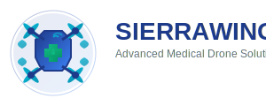

# SierraWings Drone Control Platform



SierraWings is a comprehensive web-based drone control platform designed for medical delivery services. The application supports three distinct user roles (Patient/Customer, Hospital/Clinic, and Admin) with role-based authentication, live telemetry tracking, and interactive 2D mapping capabilities.

## Features

### 🏥 Role-Based Access Control
- **Patient/Customer**: Request medical deliveries, track drones in real-time, view delivery history
- **Hospital/Clinic**: Manage delivery requests, dispatch drones, monitor live operations
- **Administrator**: Full system management, user administration, drone fleet oversight

### 🔐 Secure Authentication
- Role-based registration with invite codes
- Hospital invite code: `947316`
- Admin invite code: `583927`
- Patient registration is open (no invite code required)
- Password reset functionality
- Session management with Flask-Login

### 🚁 Live Drone Operations
- Real-time telemetry data with GPS tracking
- Interactive 2D maps using Leaflet.js
- Live mission status updates
- Battery, altitude, speed, and signal monitoring
- Flight path visualization with polylines and markers

### 📊 Comprehensive Dashboard
- Mission statistics and analytics
- Real-time status updates
- Fleet management and monitoring
- User activity tracking
- System health monitoring

## Technology Stack

### Backend
- **Flask** - Web framework
- **SQLAlchemy** - Database ORM
- **SQLite** - Database (development)
- **Flask-Login** - User session management
- **Werkzeug** - Password hashing and security

### Frontend
- **Bootstrap 5** - UI framework
- **Leaflet.js** - Interactive mapping
- **Vanilla JavaScript** - Dynamic interactions
- **Font Awesome** - Icons
- **Custom CSS** - SierraWings branding

### Database Schema
- **Users**: Authentication and profile management
- **Drones**: Fleet information and status
- **Missions**: Delivery requests and tracking
- **TelemetryLog**: Real-time flight data

## Installation & Setup

### Prerequisites
- Python 3.8 or higher
- pip (Python package installer)

### Quick Start

1. **Clone or download the project files**
   ```bash
   # Ensure all project files are in your working directory
   ```

2. **Install dependencies**
   ```bash
   pip install flask flask-login flask-sqlalchemy
   ```

3. **Set environment variables** (optional)
   ```bash
   export SESSION_SECRET="your-secret-key-here"
   export DATABASE_URL="sqlite:///sierrawings.db"
   ```

4. **Run the application**
   ```bash
   python main.py
   ```
   
   Or alternatively:
   ```bash
   flask run --host=0.0.0.0 --port=5000
   ```

5. **Access the application**
   - Open your browser and navigate to: `http://localhost:5000`
   - The application will automatically create the database and seed sample data

## Demo Accounts

The application comes with pre-configured demo accounts for testing:

| Role | Email | Password | Description |
|------|-------|----------|-------------|
| Patient | patient@example.com | password123 | Request deliveries and track drones |
| Clinic | clinic@example.com | password123 | Manage requests and dispatch drones |
| Admin | admin@example.com | password123 | Full system administration |

## User Guide

### Patient/Customer Features
1. **Request Delivery**: Submit medical delivery requests with pickup/delivery addresses
2. **Track Drone**: Real-time tracking with live map and telemetry data
3. **Mission History**: View all past and current delivery requests
4. **Status Updates**: Receive notifications on mission progress

### Hospital/Clinic Features
1. **Pending Requests**: Review and accept/reject delivery requests
2. **Dispatch Drones**: Assign available drones to accepted missions
3. **Live Operations**: Monitor all active flights with real-time telemetry
4. **Fleet Status**: View drone availability and maintenance status

### Administrator Features
1. **User Management**: Create, edit, and manage user accounts
2. **Drone Fleet**: Add, configure, and maintain drone inventory
3. **Mission Oversight**: Monitor all missions across the platform
4. **System Analytics**: View platform-wide statistics and performance metrics

## API Endpoints

### Authentication
- `POST /login` - User login
- `POST /register` - User registration
- `GET /logout` - User logout

### Missions
- `GET /api/missions/stats` - Mission statistics
- `POST /api/missions/<id>/accept` - Accept mission (clinic)
- `POST /api/missions/<id>/reject` - Reject mission (clinic)
- `POST /api/missions/<id>/dispatch` - Dispatch drone (clinic)

### Telemetry
- `GET /api/telemetry?mission_id=<id>` - Get telemetry data
- `POST /api/telemetry/simulate/<id>` - Generate simulated telemetry

### Drones
- `GET /api/drones/available` - List available drones

## Configuration

### Environment Variables
- `SESSION_SECRET`: Flask session secret key
- `DATABASE_URL`: Database connection string (defaults to SQLite)

### Invite Codes
Role-based registration requires invite codes:
- **Hospital/Clinic**: `947316`
- **Administrator**: `583927`
- **Patient**: No invite code required

## Development

### Project Structure
